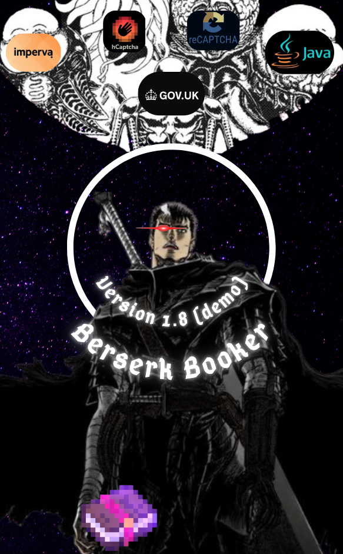

# BERSERK BOOKER

## Linux setup instructions
### Automatic
`chmod +x ./linux_setup.sh && ./linux_setup.sh`
### Manual
In-case of errors with running the setup script, do `which python python3` and ensure you are running a up-to-date, non-corrupt installation of python3 (preferably 3.12.12-3.14.3), do `pip3 install -r requirements.txt`, after you ensure that goes well, unpack `chrome-linux.../chrome.xz` (`unxz chrome.xz` if it's not unpacked already) to the same dir and make binaries inside `chrome-linux.../` and `main_linux64.elf` in `notificationProxy/main/` executable using `chmod +x bin_name`.

## Windows setup instructions
### Automatic (inside Powershell)
`.\win_setup.ps1`
### Manual
In-case of errors, follow the same steps as for the manual installation for Linux, except you don't need to ensure execute permissions for any binaries like you would on Linux.
## How to use
`BerserkBooker_v1_7_demo.elf/exe --help` for details on the command line arguments, or you can just run the executable with no arguments.

